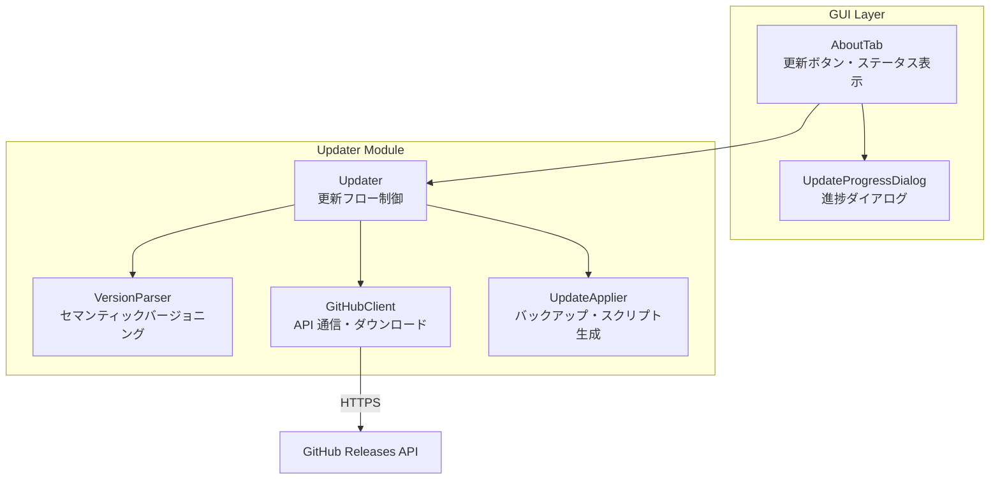
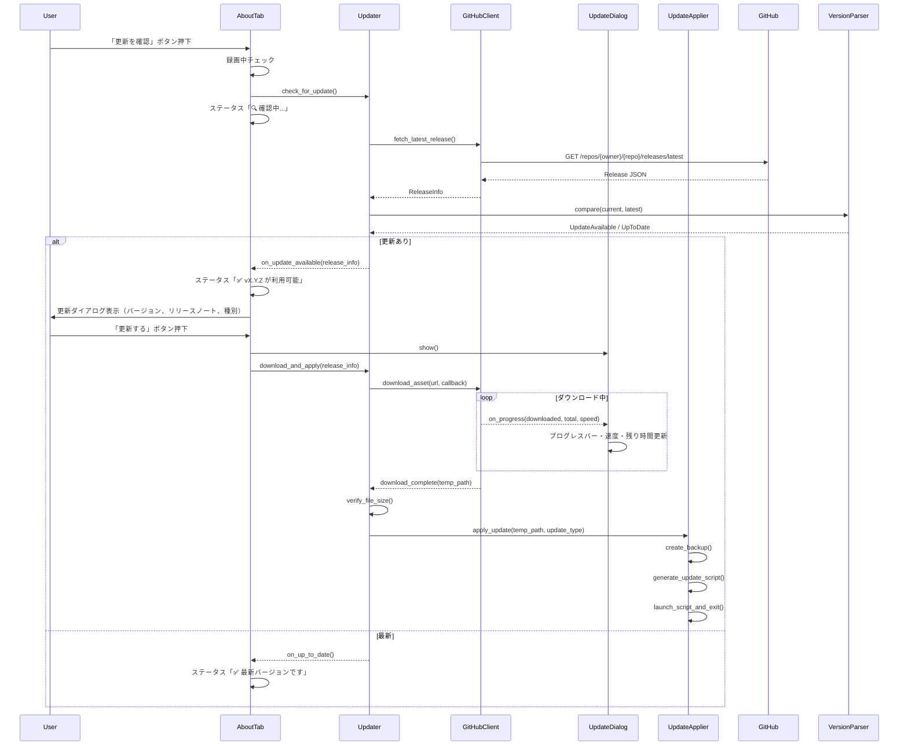
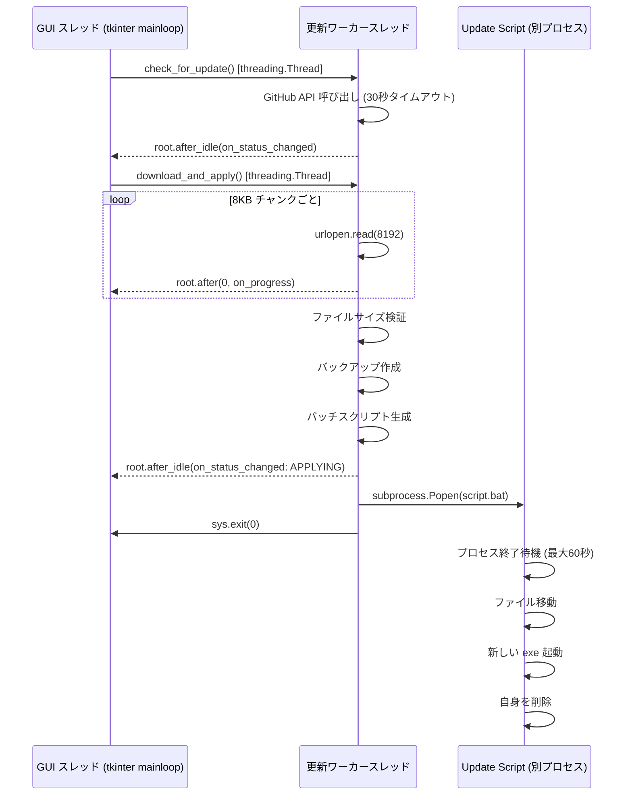

# Design Document

## Overview

Screen Audio Recorder に GitHub Releases ベースの自動更新機能を追加する。既存のアーキテクチャ（tkinter GUI + バックグラウンドスレッド + PyInstaller --onedir 配布）に沿い、新規モジュール `updater.py` と About_Tab の拡張で実現する。

### 設計方針

- **標準ライブラリ中心**: 外部 HTTP ライブラリ（requests 等）を追加せず、`urllib.request` で GitHub API / ダウンロードを実行する（既存の LlmClient と同じ方針）
- **GUI スレッド非ブロック**: すべてのネットワーク処理・ファイル操作をバックグラウンドスレッドで実行し、`root.after()` / `root.after_idle()` で GUI を更新
- **フェイルセーフ**: 更新失敗時は必ず旧バージョンに復帰する。データ（memos.json, recordings 等）には一切触れない
- **ハイブリッド配布**: リリースアセットの命名規則で通常更新（exe 単体）とフル更新（zip）を自動判別

## Architecture

### コンポーネント構成



### シーケンス図: 更新フロー全体



## Components and Interfaces

### Updater

```python
class Updater:
    """自動更新フロー制御モジュール.
    
    Validates: Requirements 1, 2, 3, 4, 5
    """

    def __init__(
        self,
        repo_owner: str,
        repo_name: str,
        current_version: str,
        exe_path: Path,
        on_status_changed: Callable[[UpdateStatus], None] | None = None,
        on_progress: Callable[[DownloadProgress], None] | None = None,
    ) -> None:
        """Updater を初期化する.
        
        Args:
            repo_owner: GitHub リポジトリオーナー
            repo_name: GitHub リポジトリ名
            current_version: 現在のアプリバージョン（例: "0.1.0"）
            exe_path: 現在実行中の exe のパス
            on_status_changed: ステータス変更コールバック（GUI スレッドに転送用）
            on_progress: ダウンロード進捗コールバック
        """

    def check_for_update(self) -> None:
        """バックグラウンドスレッドで最新バージョンを確認する.
        
        結果は on_status_changed コールバックで通知する。
        """

    def download_and_apply(self, release_info: ReleaseInfo) -> None:
        """バックグラウンドスレッドで更新をダウンロードし適用する.
        
        Args:
            release_info: ダウンロード対象のリリース情報
        """

    def cancel_download(self) -> None:
        """進行中のダウンロードをキャンセルする."""

    def rollback(self) -> None:
        """バックアップから旧バージョンに復帰する."""

    def find_backup(self) -> BackupInfo | None:
        """同一ディレクトリにバックアップが存在するか確認する."""

    def cleanup_old_backups(self) -> None:
        """古いバックアップを削除する."""
```

### GitHubClient

```python
class GitHubClient:
    """GitHub Releases API との通信を担当するクライアント.
    
    Validates: Requirements 1, 9
    """

    API_TIMEOUT: int = 30  # 秒
    DOWNLOAD_TIMEOUT: int = 600  # 秒

    def __init__(self, repo_owner: str, repo_name: str) -> None:
        """GitHubClient を初期化する."""

    def fetch_latest_release(self) -> ReleaseInfo:
        """最新リリース情報を取得する.
        
        Returns:
            ReleaseInfo: タグ名、アセット一覧、リリースノートを含む情報
            
        Raises:
            UpdateCheckError: 通信エラー、タイムアウト、パース失敗時
        """

    def download_asset(
        self,
        url: str,
        dest_path: Path,
        expected_size: int,
        on_progress: Callable[[int, int], None] | None = None,
        cancel_event: threading.Event | None = None,
    ) -> Path:
        """アセットファイルをダウンロードする.
        
        Args:
            url: ダウンロード URL
            dest_path: 保存先パス
            expected_size: 期待されるファイルサイズ（バイト）
            on_progress: 進捗コールバック (downloaded_bytes, total_bytes)
            cancel_event: キャンセル用イベント
            
        Returns:
            ダウンロード完了ファイルのパス
            
        Raises:
            DownloadError: ネットワークエラー、キャンセル、サイズ不一致時
        """
```

**実装詳細**:
- `urllib.request.urlopen()` + `ssl.create_default_context()` で HTTPS 通信
- プロキシ: `urllib.request.ProxyHandler` が環境変数 `HTTP_PROXY` / `HTTPS_PROXY` を自動参照
- ダウンロードは 8KB チャンクで読み込み、`on_progress` で進捗通知
- `cancel_event.is_set()` をチャンク読み込みごとに確認し、キャンセル検知時は即座に中断

### VersionParser

```python
class VersionParser:
    """セマンティックバージョニング解析と比較.
    
    Validates: Requirements 8
    """

    @staticmethod
    def parse(version_str: str) -> Version | None:
        """バージョン文字列をパースする.
        
        "v" / "V" プレフィックスを除去し、MAJOR.MINOR.PATCH を抽出する。
        プレリリースサフィックス（ハイフン以降）を含む場合は None を返す。
        
        Returns:
            Version: パース成功時
            None: 不正なフォーマットまたはプレリリース版
        """

    @staticmethod
    def compare(current: Version, latest: Version) -> int:
        """バージョンを比較する.
        
        Returns:
            -1: current < latest（更新あり）
             0: current == latest（最新）
             1: current > latest（ダウングレード、無視）
        """
```

### UpdateApplier

```python
class UpdateApplier:
    """バックアップ作成・更新スクリプト生成・実行.
    
    Validates: Requirements 4, 5
    """

    PROCESS_WAIT_TIMEOUT: int = 60  # 秒

    def __init__(self, exe_path: Path, app_dir: Path) -> None:
        """UpdateApplier を初期化する.
        
        Args:
            exe_path: 現在実行中の exe パス
            app_dir: アプリケーションフォルダのパス（_internal の親）
        """

    def create_backup(self, current_version: str, update_type: UpdateType) -> BackupInfo:
        """現在のファイルをバックアップする.
        
        Args:
            current_version: 現在のバージョン文字列
            update_type: EXE_ONLY または FULL
            
        Returns:
            BackupInfo: バックアップパスとバージョン情報
            
        Raises:
            UpdateError: リネーム失敗時
        """

    def generate_update_script(
        self,
        update_type: UpdateType,
        new_file_path: Path,
        target_path: Path,
        backup_info: BackupInfo,
    ) -> Path:
        """更新用バッチスクリプトを生成する.
        
        Returns:
            生成したバッチファイルのパス
        """

    def generate_rollback_script(self, backup_info: BackupInfo) -> Path:
        """ロールバック用バッチスクリプトを生成する."""

    def launch_script_and_exit(self, script_path: Path) -> None:
        """バッチスクリプトを起動し、アプリケーションを終了する."""

    def find_backup(self) -> BackupInfo | None:
        """同一ディレクトリにバックアップが存在するか確認する."""

    def cleanup_old_backups(self) -> None:
        """古いバックアップ（*.exe.bak, app-backup-v*）を削除する."""
```

### AboutTab 拡張

```python
class AboutTab:
    """既存の AboutTab を拡張し、更新機能 UI を追加する.
    
    Validates: Requirements 6, 7
    """

    def __init__(
        self,
        parent: ttk.Notebook,
        updater: Updater | None = None,
        is_recording: Callable[[], bool] | None = None,
    ) -> None:
        """AboutTab を初期化する.
        
        Args:
            parent: 親の Notebook ウィジェット
            updater: Updater インスタンス（None の場合は更新UI非表示）
            is_recording: 録画中判定コールバック
        """

    def _on_check_update(self) -> None:
        """「更新を確認」ボタンのイベントハンドラ."""

    def _on_status_changed(self, status: UpdateStatus) -> None:
        """ステータス変更時のコールバック（GUI スレッドで呼ばれる）."""

    def _on_rollback(self) -> None:
        """「前のバージョンに戻す」ボタンのイベントハンドラ."""
```

### UpdateProgressDialog

```python
class UpdateProgressDialog:
    """ダウンロード進捗を表示するモーダルダイアログ.
    
    Validates: Requirements 3, 6
    """

    UPDATE_INTERVAL_MS: int = 500  # GUI 更新間隔

    def __init__(self, parent: tk.Tk, on_cancel: Callable[[], None]) -> None:
        """進捗ダイアログを初期化する.
        
        Args:
            parent: 親ウィンドウ
            on_cancel: キャンセルボタン押下時のコールバック
        """

    def update_progress(self, progress: DownloadProgress) -> None:
        """ダウンロード進捗を更新する.
        
        Args:
            progress: ダウンロード進捗情報
        """

    def close(self) -> None:
        """ダイアログを閉じる."""
```

**レイアウト**:
```
┌──────────────────────────────────────────┐
│  ⬇️ 更新をダウンロード中...                 │
│                                          │
│  [████████████████░░░░░░░░]  67%         │
│                                          │
│  125 MB / 187 MB    12.5 MB/s            │
│  残り約 5 秒                              │
│                                          │
│              [キャンセル]                  │
└──────────────────────────────────────────┘
```

## Data Models

### ReleaseInfo

```python
@dataclass
class ReleaseInfo:
    """GitHub リリース情報."""
    tag_name: str              # 例: "v1.2.0"
    version: Version           # パース済みバージョン
    release_notes: str         # リリースノート全文
    assets: list[AssetInfo]    # アセット一覧
    update_type: UpdateType    # EXE_ONLY or FULL（アセットから判定）
    target_asset: AssetInfo    # ダウンロード対象アセット
```

### AssetInfo

```python
@dataclass
class AssetInfo:
    """リリースアセット情報."""
    name: str                  # ファイル名
    size: int                  # バイト数
    download_url: str          # ダウンロード URL
```

### Version

```python
@dataclass(frozen=True)
class Version:
    """セマンティックバージョン."""
    major: int
    minor: int
    patch: int

    def __str__(self) -> str:
        return f"{self.major}.{self.minor}.{self.patch}"

    def __lt__(self, other: "Version") -> bool: ...
    def __eq__(self, other: object) -> bool: ...
```

### UpdateType

```python
class UpdateType(Enum):
    """更新種別."""
    EXE_ONLY = "exe_only"      # 通常更新（exe 単体）
    FULL = "full"              # フル更新（zip: exe + _internal）
```

### UpdateStatus

```python
@dataclass
class UpdateStatus:
    """更新ステータス（GUI 表示用）."""
    state: UpdateState
    message: str
    version: str | None = None  # 関連バージョン
    error: str | None = None    # エラー詳細

class UpdateState(Enum):
    IDLE = "idle"
    CHECKING = "checking"
    UPDATE_AVAILABLE = "update_available"
    UP_TO_DATE = "up_to_date"
    DOWNLOADING = "downloading"
    APPLYING = "applying"
    COMPLETED = "completed"
    ERROR = "error"
```

### DownloadProgress

```python
@dataclass
class DownloadProgress:
    """ダウンロード進捗情報."""
    downloaded_bytes: int       # ダウンロード済みバイト数
    total_bytes: int            # 総バイト数
    speed_bytes_per_sec: float  # 現在の速度（バイト/秒）
    elapsed_seconds: float      # 経過時間（秒）

    @property
    def percent(self) -> int:
        """進捗率（0〜100）."""
        if self.total_bytes == 0:
            return 0
        return min(100, int(self.downloaded_bytes * 100 / self.total_bytes))

    @property
    def eta_seconds(self) -> float | None:
        """推定残り時間（秒）. 速度が 0 の場合は None."""
        if self.speed_bytes_per_sec <= 0:
            return None
        remaining = self.total_bytes - self.downloaded_bytes
        return remaining / self.speed_bytes_per_sec

    @property
    def downloaded_mb(self) -> str:
        """人間可読なダウンロード済みサイズ."""
        return f"{self.downloaded_bytes / (1024 * 1024):.1f} MB"

    @property
    def total_mb(self) -> str:
        """人間可読な総サイズ."""
        return f"{self.total_bytes / (1024 * 1024):.1f} MB"

    @property
    def speed_mb_s(self) -> str:
        """人間可読な速度."""
        return f"{self.speed_bytes_per_sec / (1024 * 1024):.1f} MB/s"
```

### BackupInfo

```python
@dataclass
class BackupInfo:
    """バックアップ情報."""
    backup_path: Path           # バックアップファイル/フォルダのパス
    version: str                # バックアップされたバージョン
    update_type: UpdateType     # バックアップ種別
    created_at: datetime        # バックアップ作成日時
```

## Update Script Template

### 通常更新（exe 単体）

```bat
@echo off
setlocal

set "PID=%1"
set "NEW_EXE=%2"
set "TARGET_EXE=%3"
set "BACKUP_EXE=%4"

echo Waiting for process %PID% to exit...
:wait_loop
tasklist /FI "PID eq %PID%" 2>NUL | find /I "%PID%" >NUL
if %ERRORLEVEL%==0 (
    timeout /t 1 /nobreak >NUL
    set /a WAIT_COUNT+=1
    if %WAIT_COUNT% GEQ 60 (
        echo Timeout: process did not exit within 60 seconds.
        echo Restoring backup...
        move /Y "%BACKUP_EXE%" "%TARGET_EXE%"
        start "" "%TARGET_EXE%"
        goto :cleanup
    )
    goto :wait_loop
)

echo Moving new exe to target path...
move /Y "%NEW_EXE%" "%TARGET_EXE%"
if %ERRORLEVEL% NEQ 0 (
    echo Failed to move new exe. Restoring backup...
    move /Y "%BACKUP_EXE%" "%TARGET_EXE%"
    start "" "%TARGET_EXE%"
    goto :cleanup
)

echo Starting updated application...
start "" "%TARGET_EXE%"

:cleanup
del "%~f0"
```

### フル更新（zip）

```bat
@echo off
setlocal

set "PID=%1"
set "NEW_DIR=%2"
set "TARGET_DIR=%3"
set "BACKUP_DIR=%4"
set "EXE_NAME=%5"

echo Waiting for process %PID% to exit...
:wait_loop
tasklist /FI "PID eq %PID%" 2>NUL | find /I "%PID%" >NUL
if %ERRORLEVEL%==0 (
    timeout /t 1 /nobreak >NUL
    set /a WAIT_COUNT+=1
    if %WAIT_COUNT% GEQ 60 (
        echo Timeout: process did not exit within 60 seconds.
        echo Restoring backup...
        rmdir /S /Q "%TARGET_DIR%" 2>NUL
        move /Y "%BACKUP_DIR%" "%TARGET_DIR%"
        start "" "%TARGET_DIR%\%EXE_NAME%"
        goto :cleanup
    )
    goto :wait_loop
)

echo Moving new files to target path...
rmdir /S /Q "%TARGET_DIR%" 2>NUL
move /Y "%NEW_DIR%" "%TARGET_DIR%"
if %ERRORLEVEL% NEQ 0 (
    echo Failed to move new files. Restoring backup...
    move /Y "%BACKUP_DIR%" "%TARGET_DIR%"
    start "" "%TARGET_DIR%\%EXE_NAME%"
    goto :cleanup
)

echo Starting updated application...
start "" "%TARGET_DIR%\%EXE_NAME%"

:cleanup
del "%~f0"
```

## File Structure

### 新規ファイル

```
src/screen_audio_recorder/
├── updater.py              # Updater, GitHubClient, VersionParser, UpdateApplier
├── updater_models.py       # ReleaseInfo, AssetInfo, Version, UpdateType, 
│                           # UpdateStatus, UpdateState, DownloadProgress, BackupInfo
└── gui/
    └── update_progress_dialog.py  # UpdateProgressDialog
```

### 変更ファイル

```
src/screen_audio_recorder/
├── __init__.py             # 変更なし（__version__ は既存）
├── gui/
│   ├── about_tab.py        # 更新ボタン・ステータス表示・ロールバックボタン追加
│   └── main_window.py      # Updater インスタンス生成、AboutTab に注入
└── main.py                 # Updater 初期化（repo_owner, repo_name を設定）
```

## Configuration

### リポジトリ設定

`src/screen_audio_recorder/updater.py` に定数として定義:

```python
_REPO_OWNER = "taicheng-huang"  # GitHub ユーザー名
_REPO_NAME = "screen-audio-recorder"  # リポジトリ名
```

### バージョンのソースオブトゥルース

`src/screen_audio_recorder/__init__.py` の `__version__` を唯一のソースとする。

- `pyproject.toml` の `version` フィールドはビルド時参照用
- GitHub Releases のタグ名は `v{__version__}` 形式（例: `v0.2.0`）
- リリース CI でタグとコードのバージョンが一致することを検証する

## Threading Model



### スレッド安全性

- `cancel_event`: `threading.Event` でダウンロードキャンセルを通知
- GUI 更新は必ず `root.after()` / `root.after_idle()` 経由
- ダウンロード速度計算: ワーカースレッド内で完結（GUI には計算結果のみ渡す）
- ファイル操作（バックアップ、スクリプト生成）: ワーカースレッド内で逐次実行

## Error Handling

### エラー分類

| エラー種別 | 発生箇所 | 対応 |
|-----------|---------|------|
| ネットワークタイムアウト | GitHubClient.fetch_latest_release() | エラーダイアログ + ステータス赤表示 |
| HTTP エラー (4xx/5xx) | GitHubClient.fetch_latest_release() | エラーダイアログ + ステータス赤表示 |
| SSL 証明書エラー | GitHubClient（全通信） | エラーダイアログ + ステータス赤表示 |
| ダウンロード中断（ネットワーク） | GitHubClient.download_asset() | 一時ファイル削除 + エラーダイアログ |
| ダウンロードキャンセル | GitHubClient.download_asset() | 一時ファイル削除 + ダイアログ閉じ |
| ファイルサイズ不一致 | Updater.download_and_apply() | 一時ファイル削除 + エラーダイアログ |
| ディスク容量不足 | Updater.download_and_apply() | ダウンロード開始前にエラー通知 |
| バックアップ作成失敗 | UpdateApplier.create_backup() | 更新中止 + エラーダイアログ |
| スクリプト生成失敗 | UpdateApplier.generate_update_script() | バックアップ復帰 + エラーダイアログ |
| zip 構造不正 | Updater.download_and_apply() | 一時ファイル削除 + エラーダイアログ |
| 録画中の操作 | AboutTab._on_check_update() | 情報ダイアログ（録画停止を促す） |

### 例外クラス階層

```python
class UpdateError(Exception):
    """更新処理の基底例外."""

class UpdateCheckError(UpdateError):
    """バージョン確認失敗."""

class DownloadError(UpdateError):
    """ダウンロード失敗."""

class DownloadCancelledError(DownloadError):
    """ダウンロードがキャンセルされた."""

class ApplyError(UpdateError):
    """更新適用失敗."""

class RollbackError(UpdateError):
    """ロールバック失敗."""
```

## Correctness Properties

### Property 1: バージョン比較の推移律

*任意の* 3つの有効なバージョン a, b, c に対して、a < b かつ b < c ならば a < c でなければならない。

**Validates: Requirements 8.3**

### Property 2: バージョン比較の反射律

*任意の* 有効なバージョン v に対して、compare(v, v) == 0 でなければならない。

**Validates: Requirements 8.5**

### Property 3: プレリリース版の除外

*任意の* ハイフンを含むバージョン文字列（例: "1.0.0-beta"）に対して、VersionParser.parse() は None を返さなければならない。

**Validates: Requirements 8.6**

### Property 4: "v" プレフィックスの正規化

*任意の* 有効なバージョン文字列 X.Y.Z に対して、parse("vX.Y.Z") == parse("X.Y.Z") == parse("VX.Y.Z") でなければならない。

**Validates: Requirements 8.2**

### Property 5: ダウンロード進捗率の単調増加

*任意の* 連続するダウンロード進捗通知に対して、percent は前回以上の値でなければならない（ネットワークエラーによるリセットを除く）。

**Validates: Requirements 3.2**

### Property 6: バックアップ後の復元可能性

*任意の* create_backup() 成功後の状態に対して、バックアップパスにファイル/フォルダが存在し、元のパスにはファイル/フォルダが存在しなければならない。

**Validates: Requirements 4.1**

### Property 7: 更新スクリプトのフェイルセーフ

*任意の* Update_Script 実行において、ファイル移動が失敗した場合、スクリプト終了時に元のパスにバックアップが復元され、アプリが起動可能状態でなければならない。

**Validates: Requirements 4.6**

## Logging

### 方針

既存アプリのログ設計に準拠し、`logging.getLogger(__name__)` でモジュールレベルのロガーを取得する。独自にハンドラやレベルを設定しない。ログは `~/.screen-audio-recorder/app.log` に記録される（既存の `_setup_logging()` が管理）。

### ログレベル分類

| レベル | 出力内容 | トラブルシューティング用途 |
|--------|---------|------------------------|
| DEBUG | API リクエスト URL・レスポンスステータスコード | 通信先の確認、プロキシ問題の切り分け |
| DEBUG | ダウンロード速度（10秒ごと）・チャンクサイズ | 速度低下・停滞の原因調査 |
| DEBUG | ファイルサイズ検証結果（期待値 vs 実測値） | サイズ不一致の詳細確認 |
| DEBUG | バッチスクリプト内容（生成時に全文ログ） | スクリプト不具合の再現・調査 |
| DEBUG | zip 展開後のファイル一覧 | フル更新時の構造不正の調査 |
| DEBUG | バックアップ先パス・リネーム元パス | パス関連エラーの調査 |
| INFO | 更新確認開始（current_version, repo_owner/repo_name） | 処理開始の確認 |
| INFO | 最新バージョン検出結果（latest_version, update_type） | 判定結果の確認 |
| INFO | ダウンロード開始（URL, expected_size） | ダウンロード対象の特定 |
| INFO | ダウンロード完了（elapsed_time, file_size） | 正常完了の確認 |
| INFO | バックアップ作成完了（backup_path, version） | バックアップの存在確認 |
| INFO | 更新スクリプト起動（script_path, PID） | スクリプト実行の追跡 |
| INFO | ロールバック実行（target_version） | ロールバック操作の記録 |
| INFO | 古いバックアップ削除（deleted_path） | クリーンアップの確認 |
| WARNING | プレリリース版スキップ（tag_name） | 意図しないスキップの確認 |
| WARNING | 不正なバージョン形式検出（raw_tag_name） | タグ命名ミスの検出 |
| WARNING | zip 内に想定外のファイル構造を検出 | フル更新パッケージの問題検出 |
| WARNING | ディスク空き容量が少ない（available, required） | 容量問題の早期検出 |
| ERROR | API 接続失敗（URL, status_code, error_message） | ネットワーク問題の特定 |
| ERROR | SSL/TLS 証明書検証失敗（hostname, error_detail） | セキュリティ問題の特定 |
| ERROR | ダウンロード中断（bytes_downloaded, total_bytes, reason） | 中断原因の特定 |
| ERROR | バックアップ作成失敗（source_path, dest_path, OSError） | ファイルシステム権限問題の特定 |
| ERROR | スクリプト生成失敗（target_path, error_detail） | 書き込み権限・ディスク問題の特定 |
| ERROR | ロールバック失敗（backup_path, target_path, error） | 復旧不能時の原因追跡 |

### ログ出力例

```
2025-06-11 10:30:01 INFO  updater: 更新確認開始 current=0.1.0 repo=taicheng-huang/screen-audio-recorder
2025-06-11 10:30:02 DEBUG updater: GET https://api.github.com/repos/taicheng-huang/screen-audio-recorder/releases/latest -> 200
2025-06-11 10:30:02 INFO  updater: 新しいバージョン検出 latest=0.2.0 update_type=FULL
2025-06-11 10:30:05 INFO  updater: ダウンロード開始 url=https://github.com/.../screen-audio-recorder-v0.2.0-full.zip size=418MB
2025-06-11 10:30:15 DEBUG updater: ダウンロード進捗 125MB/418MB speed=12.5MB/s
2025-06-11 10:30:38 INFO  updater: ダウンロード完了 elapsed=33s size=418MB
2025-06-11 10:30:38 DEBUG updater: ファイルサイズ検証 expected=438304768 actual=438304768 OK
2025-06-11 10:30:39 INFO  updater: バックアップ作成完了 path=C:\app\app-backup-v0.1.0
2025-06-11 10:30:39 INFO  updater: 更新スクリプト起動 script=C:\Users\user\AppData\Local\Temp\update_xxxx.bat PID=12345
```

### 詳細ログモード

既存の `AppSettings.verbose_logging` が `True` の場合、DEBUG レベルのログも `app.log` に記録される。デフォルト（`False`）では INFO 以上のみファイルに出力される。

トラブルシューティング時は「詳細設定タブ → 詳細ログ有効」をオンにしてアプリを再起動し、更新操作を再試行することで詳細な情報を取得できる。

## Testing Strategy

### プロパティベーステスト

```python
# Property 1: バージョン比較の推移律
@given(
    st.tuples(st.integers(0, 99), st.integers(0, 99), st.integers(0, 99)),
    st.tuples(st.integers(0, 99), st.integers(0, 99), st.integers(0, 99)),
    st.tuples(st.integers(0, 99), st.integers(0, 99), st.integers(0, 99)),
)
@settings(max_examples=200)
def test_version_comparison_transitivity(a, b, c): ...

# Property 2: バージョン比較の反射律
@given(st.tuples(st.integers(0, 99), st.integers(0, 99), st.integers(0, 99)))
@settings(max_examples=100)
def test_version_comparison_reflexivity(v): ...

# Property 4: "v" プレフィックスの正規化
@given(st.integers(0, 99), st.integers(0, 99), st.integers(0, 99))
@settings(max_examples=100)
def test_version_prefix_normalization(major, minor, patch): ...
```

### ユニットテスト

| テスト対象 | テスト内容 |
|-----------|-----------|
| VersionParser.parse() | 正常系・異常系・プレリリース・プレフィックス |
| VersionParser.compare() | 大小比較・等値・ダウングレード検出 |
| GitHubClient.fetch_latest_release() | モック API レスポンス解析 |
| GitHubClient.download_asset() | モック HTTP レスポンス・キャンセル・サイズ検証 |
| UpdateApplier.create_backup() | ファイル/フォルダリネーム・命名規則 |
| UpdateApplier.generate_update_script() | スクリプト内容の正当性 |
| Updater.check_for_update() | 更新あり/なし/エラーの各パス |
| AboutTab | ボタン状態遷移・ステータス表示テキスト |
| DownloadProgress | percent, eta_seconds, 表示文字列 |

### 統合テスト

- 実際の GitHub API を使用した接続テスト（`@pytest.mark.integration`）
- バッチスクリプトの手動実行テスト（Windows環境）
