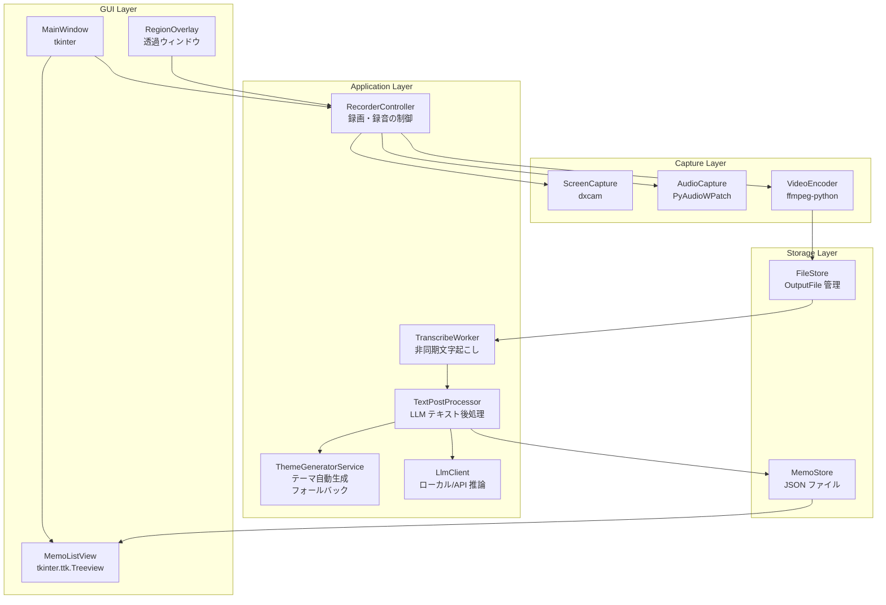

# 技術設計書: screen-audio-recorder

## 概要

本設計書は、Windows ローカル環境で動作する画面・音声録画アプリケーション「screen-audio-recorder」の技術設計を定義します。本アプリは管理者権限なしで動作し、画面録画・マイク音声・システム音声の同時録音、ローカル文字起こし、メモ管理機能を提供します。

### 設計方針

- **ゼロ管理者権限**: UAC 昇格を一切要求しない設計
- **ローカルファースト**: 音声データ・文字起こし結果を外部サーバーに送信しない
- **単一実行ファイル配布**: PyInstaller による `.exe` 形式での配布
- **ユーザーホームディレクトリ完結**: すべてのデータを `%USERPROFILE%\.screen-audio-recorder\` 配下に保存

### リサーチ結果サマリー

| 領域 | 採用技術 | 根拠 |
|------|----------|------|
| 画面キャプチャ | `dxcam` (DXGI Desktop Duplication API) | 管理者権限不要、60fps+ 対応、Windows 専用最適化 |
| システム音声 | `PyAudioWPatch` (WASAPI ループバック) | 管理者権限不要で WASAPI ループバック録音が可能な唯一の Python ライブラリ |
| マイク音声 | `PyAudioWPatch` | システム音声と同一ライブラリで統一管理 |
| 映像エンコード | `ffmpeg-python` + 同梱 ffmpeg バイナリ | H.264/MP4 出力、MP3/WAV 出力に対応。HW エンコーダ自動検出（NVENC/AMF/QSV） |
| 文字起こし | `faster-whisper` (CTranslate2 最適化) | 標準 Whisper の最大 4 倍高速、CPU/GPU 両対応、日本語精度良好。モデルサイズはユーザー選択可能（デフォルト: small） |
| テーマ生成 | `janome` + キーワード抽出ロジック | ローカル日本語形態素解析、外部依存なし |
| GUI | `tkinter` (Python 標準ライブラリ) | 追加インストール不要、Windows ネイティブ外観 |
| データ永続化 | JSON ファイル | シンプル、管理者権限不要、可読性高 |
| 配布 | `PyInstaller` (--onedir モード) | 管理者権限不要、ユーザーディレクトリへの展開 |

---

## アーキテクチャ

### 全体構成



### スレッドモデル

```mermaid
sequenceDiagram
    participant Main as メインスレッド (GUI)
    participant Capture as キャプチャワーカー
    participant PipeWriter as パイプ書き込みスレッド
    participant SysAudio as システム音声ポーリングスレッド
    participant Transcribe as 文字起こしスレッド

    Main->>Capture: 録画開始
    Capture-->>PipeWriter: フレームデータキュー (maxsize=30)
    PipeWriter-->>Note: ffmpeg stdin に書き込み
    Main->>SysAudio: 音声録音開始
    SysAudio-->>Note: get_read_available() ポーリング + WAV 書き込み
    Main->>Capture: 録画停止
    Capture->>PipeWriter: 終了シグナル (None)
    PipeWriter->>Note: ffmpeg stdin close
    SysAudio->>Note: WAV close
    Note->>Transcribe: OutputFile パス
    Transcribe-->>Main: 完了通知 (after_idle)
```

- **メインスレッド**: GUI イベントループ（tkinter）
- **キャプチャワーカー**: dxcam/mss からフレーム取得、FPS タイマー制御（`threading.Thread`）
- **パイプ書き込みスレッド**: キューからフレームデータを取り出して ffmpeg stdin に書き込み（非ブロッキング化）
- **システム音声ポーリングスレッド**: `get_read_available()` でデータ有無を確認し、WAV に書き込み。データなし時は無音を挿入
- **文字起こしスレッド**: `faster-whisper` 推論（CPU バウンド、別スレッドで GUI をブロックしない）

---

## コンポーネントとインターフェース

### ScreenCapture

```python
class ScreenCapture:
    def start(self, region: RecordingRegion) -> None:
        """指定領域のキャプチャを開始する"""

    def stop(self) -> None:
        """キャプチャを停止する"""

    def get_frame_queue(self) -> queue.Queue[np.ndarray]:
        """フレームキューを返す（エンコーダが消費する）"""

    def set_region(self, region: RecordingRegion) -> None:
        """録画領域をリアルタイムで変更する"""

    def get_preview_frame(self) -> np.ndarray | None:
        """プレビュー用の最新フレームを返す"""
```

**実装詳細**:
- `dxcam` を第一選択として使用（DXGI Desktop Duplication API、GPU メモリ直接アクセスで高速・低CPU負荷）
- `dxcam` が利用不可の場合（古い GPU 等）は `mss` にフォールバック
- `dxcam` 使用時も `camera.grab(region=(left, top, right, bottom))` で指定領域のみをキャプチャする
- フレームレート制御: `time.perf_counter()` を使用して 15fps を保証
- ウィンドウキャプチャ: `win32gui.GetWindowRect()` でウィンドウ座標を取得
- DPI 対応: `main()` で `SetProcessDpiAwareness(2)` を設定し、tkinter と mss/dxcam の座標系を物理ピクセルで統一

### AudioCapture

```python
class AudioCapture:
    def start(self, mic_device_index: int | None, system_audio: bool) -> None:
        """マイクおよびシステム音声の録音を開始する"""

    def stop(self) -> None:
        """録音を停止する"""

    def get_audio_queue(self) -> queue.Queue[AudioChunk]:
        """ミックス済み音声チャンクキューを返す"""

    def list_mic_devices(self) -> list[MicDevice]:
        """利用可能なマイクデバイス一覧を返す"""
```

**実装詳細**:
- `PyAudioWPatch` の WASAPI ループバックモードでシステム音声を取得
- マイク音声と同一サンプルレート（44100Hz、16bit、ステレオ）に統一
- システム音声とマイク音声を別々の WAV ファイルに録音し、停止後に ffmpeg でマージ
- **音声マージの堅牢性**: Windows のファイルハンドル解放遅延に対応するため、マージ後のリネームは `shutil.move` + リトライ（最大5回、0.5秒間隔）で実行。最終的に失敗した場合は `.merged.wav` をそのまま使用し、VideoEncoder 側でもフォールバックパスを探索する
- **システム音声のポーリング + タイマーベース無音挿入方式**:
  - 専用スレッドで `get_read_available()` をポーリング
  - データがあれば `stream.read()` で読み取って WAV に書き込む
  - データがなければ（= WASAPI が無音時にデータを返さない）無音チャンクを自分で書き込む
  - タイマー間隔: `CHUNK_SIZE / sample_rate` 秒（約 0.085秒）
  - これにより WAV の長さが実時間と正確に一致する
- **音量自動調整**: 録音中に各コールバックで RMS（二乗平均平方根）を累積追跡し、マージ時にシステム音声の平均 RMS ÷ マイクの平均 RMS でゲインを算出。ffmpeg の `volume` フィルタでマイク音声を増幅してからミックスする
  - 無音チャンク（RMS < 0.0001）は集計から除外し、実際に音が出ている区間の平均を使用
  - ゲイン上限: 50 倍（約 34 dB）— 過度な増幅によるノイズ増大を防止
  - 音量ログ: 1 秒ごとに各ストリームの RMS と dB をログ出力（デバッグ用）
- **マイクストリーム停止のタイムアウト**: `stop_stream()` を別スレッドで実行し、5秒でタイムアウト（PyAudioWPatch のハング対策）
- デバイス利用不可時は警告ダイアログを表示し、利用可能な音声のみで継続

### VideoEncoder

```python
class VideoEncoder:
    def start(self, output_path: Path, fps: int, resolution: tuple[int, int]) -> None:
        """ffmpeg プロセスを起動し、エンコードを開始する"""

    def write_frame(self, frame: np.ndarray) -> None:
        """フレームを ffmpeg の stdin に書き込む"""

    def write_audio(self, audio_chunk: AudioChunk) -> None:
        """音声チャンクを ffmpeg の stdin に書き込む"""

    def finish(self) -> Path:
        """エンコードを完了し、OutputFile のパスを返す"""
```

**実装詳細**:
- ffmpeg バイナリをアプリケーションに同梱（`_internal/ffmpeg.exe`）
- **HW エンコーダ自動検出**: 起動時に h264_nvenc → h264_amf → h264_qsv の順でテストエンコードを実行し、動作するものを自動選択。全て失敗した場合は libx264 ultrafast にフォールバック
- 映像: H.264 (`libx264 veryfast` or HW エンコーダ)、CRF 18、`yuv420p`
- 高解像度（1920×1080 超）の場合は ffmpeg 側で `scale=1920:-2` でリサイズ
- **パイプ書き込み専用スレッド**: `write_frame()` はキュー（maxsize=30）に入れるだけで即座に返る。別スレッドがキューからデータを取り出して ffmpeg の stdin に書き込む。これにより write_frame のブロックを防ぐ
- **`_first_pipe_write_done` イベント**: パイプライタースレッドが最初のフレームを実際に ffmpeg に書き込み完了した時点でセット。音声録音はこのイベント後に開始する
- **映像+音声結合**: 映像は録画時に既に H.264 エンコード済みのため、結合時は `-c:v copy`（ストリームコピー）を使用し再エンコードしない。これにより2〜3時間の長時間録画でも数十秒で結合が完了する
- **タイムアウト**: `-c:v copy` のため長時間録画でも高速に完了する。タイムアウトは `max(60, 録画時間÷12 + 60)` 秒
- 音声: AAC 128kbps（MP4 内）、MP3 192kbps（録音のみモード）、WAV PCM（録音のみモード）
- ffmpeg を `subprocess.Popen` でサブプロセスとして起動し、stdin にパイプ
- **コンソールウィンドウ非表示**: すべての `subprocess.run` / `subprocess.Popen` に `creationflags=CREATE_NO_WINDOW` を指定し、ffmpeg のコンソールウィンドウを抑制する

### Transcriber

```python
class Transcriber:
    def __init__(self, model_size: str = "small") -> None:
        """faster-whisper モデルをロードする"""

    def transcribe(self, audio_path: Path) -> TranscribeResult:
        """音声ファイルを文字起こしする（同期）"""

    def transcribe_async(
        self,
        audio_path: Path,
        callback: Callable[[TranscribeResult], None]
    ) -> None:
        """非同期で文字起こしを実行し、完了時に callback を呼ぶ"""
```

**実装詳細**:
- `faster-whisper` の `WhisperModel` を使用（モデルサイズ: `small` をデフォルト、ユーザーが設定から tiny/base/small/medium/large を選択可能）
- 言語を `ja`（日本語）に固定
- モデルファイルは初回起動時に `~/.screen-audio-recorder/models/` にダウンロード・キャッシュ
- **遅延ロード**: `lazy_load=True` で初期化し、メインウィンドウ表示後にバックグラウンドスレッドでモデルをロード（`load_model_async()`）。ロード完了まで録画ボタンは無効化され、ステータスバーに「モデル読み込み中...」と表示される
- 推論は別スレッドで実行し、完了後に `root.after_idle()` で GUI スレッドに通知
- **output_path のクロージャキャプチャ**: `stop_recording()` で `transcribe_async` を呼ぶ際に `output_path` をクロージャでキャプチャし、次の録画開始で `_current_output_path` が上書きされても正しいパスでメモが保存される
- モデルサイズは `LlmSettings.whisper_model_size` から取得し、設定変更は次回文字起こし時に反映

### ThemeGeneratorService（フォールバック用）

```python
class ThemeGeneratorService:
    def generate(self, text: str) -> str:
        """文字起こしテキストから 10 文字以内のテーマを生成する（janome ベース）"""
```

**実装詳細**:
- `janome.tokenizer.Tokenizer` で形態素解析
- 名詞・動詞・形容詞を抽出し、出現頻度上位のキーワードを結合
- 結合結果が 10 文字を超える場合は先頭 10 文字に切り詰め
- 入力テキストが空（空文字列・空白のみ・None）の場合は `"無題"` を返す
- LLM が利用不可の場合のフォールバックとして使用

### LlmClient

```python
class LlmClient:
    def __init__(self, settings: LlmSettings) -> None:
        """LLM クライアントを初期化する"""

    def generate(self, prompt: str) -> str | None:
        """プロンプトを送信してテキストを生成する（失敗時は None）"""

    @property
    def available(self) -> bool:
        """LLM が利用可能かどうかを返す"""

    def reload(self, settings: LlmSettings) -> None:
        """設定変更時にクライアントを再初期化する"""
```

**実装詳細**:
- バックエンド選択: `LlmBackend.LOCAL`（llama-cpp-python）または `LlmBackend.API`（OpenAI 互換）
- ローカルモード: `llama_cpp.Llama` でモデルをロードし推論
- API モード: `urllib.request` で OpenAI 互換 API（`/v1/chat/completions`）に POST
- 外部 HTTP ライブラリ（requests 等）を追加せず、標準ライブラリのみで API 通信
- 推論失敗時は `None` を返し、呼び出し元でフォールバック処理

### TextPostProcessor

```python
class TextPostProcessor:
    def __init__(
        self,
        llm_client: LlmClient,
        theme_generator_fallback: ThemeGeneratorService,
        settings: LlmSettings,
    ) -> None:
        """テキスト後処理サービスを初期化する"""

    def process(self, text: str) -> PostProcessResult:
        """文字起こしテキストを後処理する（修正・要約・テーマ生成）"""
```

**実装詳細**:
- 3 つのタスクを順次実行: テキスト修正 → 要約生成 → テーマ生成
- 各タスクのプロンプトは `LlmSettings` から取得（ユーザーカスタマイズ可能）
- LLM 失敗時のフォールバック:
  - テキスト修正: 元テキストをそのまま使用
  - 要約生成: 空文字列
  - テーマ生成: `ThemeGeneratorService.generate()` で janome ベース生成

### LlmSettings

```python
@dataclass
class LlmSettings:
    backend: LlmBackend              # LOCAL or API
    local_model_path: str             # ローカル GGUF モデルのパス
    api_endpoint: str                 # OpenAI 互換 API の URL
    api_key: str                      # API キー（オプション）
    prompt_fix_text: str              # テキスト修正プロンプトテンプレート
    prompt_summarize: str             # 要約生成プロンプトテンプレート
    prompt_theme: str                 # テーマ生成プロンプトテンプレート
    max_tokens: int                   # 最大生成トークン数
    temperature: float                # 生成温度
    whisper_model_size: str           # Whisper モデルサイズ（tiny/base/small/medium/large、デフォルト: small）
```

**永続化**: `~/Documents/screen-audio-recorder/llm_settings.json` に JSON 形式で保存

### MemoStore

```python
class MemoStore:
    def create(self, text: str, theme: str, output_file: Path) -> Memo:
        """メモを作成し保存する"""

    def get_all(self, page: int = 1, page_size: int = 50) -> MemoPage:
        """メモを作成日時の降順でページネーション付きで返す"""

    def get_by_id(self, memo_id: str) -> Memo | None:
        """ID でメモを取得する"""

    def delete(self, memo_id: str) -> None:
        """メモを削除する"""
```

**実装詳細**:
- データファイル: `~/.screen-audio-recorder/memos.json`
- ファイルロック: `filelock` ライブラリで排他制御
- ページネーション: `page_size=50`、100 件超で自動適用
- メモ ID: `uuid4()` で生成

### RecorderController

```python
class RecorderController:
    def start_recording(self, mode: RecordingMode, region: RecordingRegion) -> None:
        """録画または録音を開始する"""

    def stop_recording(self) -> None:
        """録画または録音を停止し、後処理を開始する"""

    def update_region(self, region: RecordingRegion) -> None:
        """録画領域をリアルタイムで更新する"""
```

**録画開始シーケンス（SCREEN_AND_AUDIO モード）**:

```
1. DPI awareness 設定済み（main() で SetProcessDpiAwareness(2)）
2. screen_capture.start(region) → dxcam でフレームキューにフレームが溜まり始める
3. 解像度ポーリング（actual_resolution を取得）
4. video_encoder.start() → ffmpeg プロセス起動 + パイプ書き込みスレッド起動
5. _video_capture_worker スレッド起動 → キューの古いフレームを破棄
6. _first_pipe_write_done.wait() → ffmpeg が最初のフレームを実際に受け取るまで待機
7. _video_start_time を記録
8. audio_capture.start_direct_recording() → システム音声 + マイク録音開始
9. 各ストリームの開始時刻を記録
10. 一番遅いストリーム（通常はマイク）を基準に video_trim を計算
```

**録画停止シーケンス**:

```
1. mark_recording_end() → 壁時計時間を即座に記録
2. _stop_event.set() → キャプチャワーカー停止
3. capture_thread.join()
4. audio_capture.stop() → システム音声 read スレッド停止 → マイク停止 → WAV マージ
5. screen_capture.stop()
6. video_encoder.finish() → パイプスレッド停止 → ffmpeg 終了 → 映像+音声結合
7. transcriber.transcribe_async() → 文字起こし開始
```

**映像・音声結合時の同期**:

```
ffmpeg -y -ss {video_trim} -i video.mp4 -i audio.wav
       -c:v copy -c:a aac -b:a 128k -shortest output.mp4
```

- `video_trim`: 一番遅いストリームの開始時刻 - 映像開始時刻（通常 0.2〜0.3秒）
- `-c:v copy`: 映像は録画時に既に H.264 エンコード済みのためストリームコピー（再エンコード不要で高速）
- `-shortest`: 短い方のストリームに合わせて末尾を切る
- **フォールバック**: 音声 WAV が見つからない場合、`.audio.wav.merged.wav` を自動探索する

---

## データモデル

### RecordingRegion

```python
@dataclass
class RecordingRegion:
    x: int          # 左上 X 座標（ピクセル）
    y: int          # 左上 Y 座標（ピクセル）
    width: int      # 幅（ピクセル）、最小 320
    height: int     # 高さ（ピクセル）、最小 240
    
    MIN_WIDTH: ClassVar[int] = 320
    MIN_HEIGHT: ClassVar[int] = 240
    
    def clamp(self, display_width: int, display_height: int) -> "RecordingRegion":
        """最小・最大サイズの範囲内に収める"""
```

### AudioChunk

```python
@dataclass
class AudioChunk:
    data: np.ndarray    # shape: (samples, channels), dtype: float32
    sample_rate: int    # 44100
    timestamp: float    # time.perf_counter() 値
```

### TranscribeResult

```python
@dataclass
class TranscribeResult:
    text: str
    language: str           # "ja"
    duration_seconds: float
    error: str | None       # 失敗時のエラーメッセージ
```

### Memo

```python
@dataclass
class Memo:
    id: str                 # UUID4
    created_at: datetime    # UTC
    theme: str              # 10 文字以内
    body: str               # 文字起こし全文（修正済み）
    summary: str            # 内容要約
    output_file: Path       # OutputFile への絶対パス
```

**JSON 永続化形式**:

```json
{
  "version": 1,
  "memos": [
    {
      "id": "550e8400-e29b-41d4-a716-446655440000",
      "created_at": "2024-01-15T10:30:00Z",
      "theme": "会議メモ",
      "body": "本日の会議では...",
      "summary": "プロジェクトの進捗報告と次回スケジュールの確認が行われた。",
      "output_file": "C:/Users/user/.screen-audio-recorder/recordings/2024-01-15_10-30-00.mp4"
    }
  ]
}
```

### MemoPage

```python
@dataclass
class MemoPage:
    memos: list[Memo]
    total: int
    page: int
    page_size: int
    total_pages: int
```

### RecordingMode

```python
class RecordingMode(Enum):
    SCREEN_AND_AUDIO = "screen_and_audio"
    AUDIO_ONLY = "audio_only"
```

### ディレクトリ構造

```
%USERPROFILE%\.screen-audio-recorder\
├── memos.json              # メモデータ
├── models\                 # Whisper モデルキャッシュ
│   └── faster-whisper-small\
└── recordings\             # OutputFile 保存先
    ├── 2024-01-15_10-30-00.mp4
    ├── 2024-01-15_10-30-00.mp3
    └── ...
```

---

## 正確性プロパティ

*プロパティとは、システムのすべての有効な実行において成立すべき特性または振る舞いのことです。プロパティは人間が読める仕様と機械検証可能な正確性保証の橋渡しとなります。*

### プロパティ 1: ファイル書き込みパスの制約

*任意の* メモ・録音ファイルの保存操作に対して、書き込まれるすべてのファイルパスは `pathlib.Path.home()` 配下でなければならない。

**検証対象: 要件 1.3、8.2**

---

### プロパティ 2: 録画出力フォーマット

*任意の* 画面録画セッションに対して、生成される OutputFile のコンテナフォーマットは MP4、ビデオコーデックは H.264 でなければならない。

**検証対象: 要件 2.5**

---

### プロパティ 3: フレームレート保証

*任意の* RecordingRegion サイズ（320×240 以上）に対して、録画中の実測フレームレートは 15fps 以上でなければならない。

**検証対象: 要件 2.3**

---

### プロパティ 4: スクロールによる領域サイズ変更

*任意の* スクロール量（正の値は拡大、負の値は縮小）に対して、RecordingRegion のサイズはスクロール量と同じ方向に変化し、かつ最小サイズ（320×240）以上・最大サイズ（ディスプレイ解像度）以下の範囲内に収まらなければならない。

**検証対象: 要件 3.1、3.2、3.3**

---

### プロパティ 5: 音声チャンネルの独立性

*任意の* MicAudio データと SystemAudio データに対して、AudioCapture はそれぞれを独立したバッファに格納し、ミックス前に互いのデータを上書きしてはならない。

**検証対象: 要件 4.3**

---

### プロパティ 6: 音声ミックスの完全性

*任意の* MicAudio バッファと SystemAudio バッファに対して、ミックス結果は両方の音声成分を含む有効な音声データでなければならない（サンプル数・チャンネル数・サンプルレートが一致し、振幅が [-1.0, 1.0] の範囲内に収まること）。

**検証対象: 要件 4.4**

---

### プロパティ 6a: 音量自動調整のゲイン制約

*任意の* MicAudio と SystemAudio の平均 RMS の組み合わせに対して、AudioCapture が算出するマイクゲインは 1.0 以上 50.0 以下でなければならない。また、両方の平均 RMS が 0.0001 を超える場合にのみゲイン補正が適用されなければならない。

**検証対象: 要件 4.5、4.6**

---

### プロパティ 7: 録音のみモードの出力フォーマット

*任意の* 録音のみモードのセッションに対して、生成される OutputFile のフォーマットは MP3 または WAV でなければならない。

**検証対象: 要件 5.3**

---

### プロパティ 8: 文字起こし結果の MemoStore への伝達

*任意の* 文字起こし結果テキストに対して、Transcriber は MemoStore.create() を正確にそのテキストを引数として呼び出さなければならない。

**検証対象: 要件 6.3**

---

### プロパティ 9: テーマの文字数制約

*任意の* 文字起こしテキスト（空でないもの）に対して、ThemeGeneratorService が生成するテーマは 10 文字以内でなければならない。

**検証対象: 要件 7.1**

---

### プロパティ 10: 空テキストに対するテーマ

*任意の* 「空」に相当する入力（空文字列、空白のみの文字列、None）に対して、ThemeGeneratorService は `"無題"` を返さなければならない。

**検証対象: 要件 7.3**

---

### プロパティ 11: メモの保存と読み込みのラウンドトリップ

*任意の* メモデータ（テキスト・テーマ・OutputFile パス）に対して、MemoStore に保存後に読み込んだメモは、作成日時・テーマ・本文・OutputFile パスのすべてのフィールドを正確に保持していなければならない。

**検証対象: 要件 8.1**

---

### プロパティ 12: メモ削除後の不存在

*任意の* 保存済みメモに対して、削除操作後に MemoStore.get_by_id() を呼び出した結果は None でなければならない。

**検証対象: 要件 8.3**

---

### プロパティ 13: メモ一覧の降順ソート

*任意の* 順序で作成された複数のメモに対して、MemoStore.get_all() が返すメモリストは作成日時の降順でソートされていなければならない。

**検証対象: 要件 9.1**

---

### プロパティ 14: メモ一覧の表示情報

*任意の* メモデータに対して、MemoList のリスト表示には作成日時・テーマ・本文の先頭 50 文字が含まれていなければならない（本文が 50 文字未満の場合は全文）。

**検証対象: 要件 9.2**

---

### プロパティ 15: メモ全文表示

*任意の* メモを選択したとき、MemoList の詳細表示に表示されるテキストはメモの body フィールドと完全に一致しなければならない。

**検証対象: 要件 9.3**

---

### プロパティ 16: ページネーション適用

*任意の* N > 100 件のメモに対して、MemoStore.get_all() は一度に最大 page_size 件のメモのみを返し、total_pages が ceil(N / page_size) と等しくなければならない。

**検証対象: 要件 9.5**

---

**プロパティ反省（冗長性の排除）:**

- プロパティ 1 と 8.2 は同一の性質（ファイルパス制約）のため統合済み（プロパティ 1）
- プロパティ 4 はスクロール変化方向（3.1）と境界制約（3.2、3.3）を一つのプロパティに統合済み
- プロパティ 9 と 10 は独立した性質（非空テキストの文字数制約 vs 空テキストの固定値）のため分離を維持

---

## バージョン情報（AboutTab）

### コンポーネント構成

- `gui/about_tab.py`: 「このアプリについて」タブ UI

### メタデータ定義

`src/screen_audio_recorder/__init__.py` に以下の定数を定義:

```python
__version__ = "0.1.0"
__author__ = "Taicheng Huang"
__company__ = "AKKODiSコンサルティング株式会社"
__license__ = "Proprietary"
```

### AboutTab

```python
class AboutTab:
    def __init__(self, parent: ttk.Notebook) -> None:
        """「このアプリについて」タブを初期化する"""

    @property
    def frame(self) -> ttk.Frame:
        """タブのフレームを返す"""
```

**表示内容**:
- アプリケーション名: "Screen Audio Recorder"
- バージョン: `__version__` から取得
- 作者: `__author__` から取得
- 会社: `__company__` から取得
- ライセンス: `__license__` から取得
- 著作権表示: `© 2025 {__company__}`

**配置**: `MainWindow` の `ttk.Notebook` に「詳細設定」タブの後に追加

---

## エラーハンドリング

### エラー分類と対応方針

| エラー種別 | 発生箇所 | 対応 |
|-----------|---------|------|
| マイクデバイス利用不可 | AudioCapture.start() | 警告ダイアログ表示、SystemAudio のみで継続 |
| SystemAudio 取得失敗 | AudioCapture.start() | 警告ダイアログ表示、MicAudio のみで継続 |
| 両音声デバイス利用不可 | AudioCapture.start() | エラーダイアログ表示、録音中止 |
| ffmpeg エンコードエラー | VideoEncoder.finish() | エラーダイアログ表示、一時ファイルを保持 |
| 文字起こし失敗 | Transcriber.transcribe() | エラーダイアログ表示、空テキストでメモ作成 |
| メモ保存失敗 | MemoStore.create() | エラーダイアログ表示、OutputFile は保持 |
| ディスク容量不足 | VideoEncoder / MemoStore | 警告ダイアログ表示、録画中止または保存中止 |
| モデルダウンロード失敗 | Transcriber.__init__() | エラーダイアログ表示、文字起こし機能を無効化 |

### エラー通知 UI

```python
class ErrorNotifier:
    def show_warning(self, title: str, message: str) -> None:
        """警告ダイアログを表示する（処理は継続）"""

    def show_error(self, title: str, message: str) -> None:
        """エラーダイアログを表示する（処理は中止）"""
```

- すべてのエラー通知は GUI スレッドから `root.after_idle()` 経由で呼び出す
- エラーログは `~/.screen-audio-recorder/app.log` に記録（`logging` モジュール使用）

---

## ログ管理

### 設計方針

ログ設定は `main.py` の `_setup_logging()` に一元化する。各モジュールは `logging.getLogger(__name__)` でロガーを取得するのみで、独自にハンドラやレベルを設定しない。

### ログレベル切り替え

| モード | ファイル出力 | コンソール出力 | 切り替え方法 |
|--------|-------------|---------------|-------------|
| 通常（デフォルト） | INFO | WARNING | — |
| 詳細ログ有効 | DEBUG | DEBUG | 詳細設定タブのトグル → アプリ再起動 |

### 設定の永続化

```python
@dataclass
class AppSettings:
    verbose_logging: bool = False  # 詳細ログの有効/無効
```

**永続化ファイル**: `~/Documents/screen-audio-recorder/app_settings.json`

```json
{
  "verbose_logging": false
}
```

### ログレベル分類

| レベル | 出力内容 |
|--------|---------|
| DEBUG | 音量 RMS（毎秒）、ストリーム診断、同期オフセット、映像フレーム破棄数、壁時計時間、ffmpeg コマンド詳細、llama-server stdout |
| INFO | 録画開始/停止、文字起こし開始/完了、メモ保存、LLM 設定変更、デバイス検出、エンコード完了 |
| WARNING | デバイス利用不可（継続可能）、設定ファイル読み込み失敗（デフォルト使用） |
| ERROR | 両デバイス利用不可（中止）、エンコードエラー、文字起こし失敗、メモ保存失敗 |

### コンポーネント構成

- `app_settings_store.py`: `AppSettings` の読み書き（`load_app_settings()` / `save_app_settings()`）
- `gui/advanced_settings_tab.py`: 詳細設定タブ UI（トグル + 保存ボタン）
- `main.py` `_setup_logging()`: 起動時に `app_settings.json` を読み込み、ログレベルを決定

### 注意事項

- `ErrorNotifier` はロガーの取得のみ行い、独自のハンドラ追加は行わない（二重出力防止）
- ルートロガーのレベル設定がすべての子ロガーに伝播するため、名前付きロガーに個別レベルを設定しない

---

## テスト戦略

### テスト方針

本機能は純粋関数・データ変換・ビジネスロジックを多く含むため、プロパティベーステスト（PBT）が有効です。GUI レンダリングや外部デバイス（マイク・GPU）に依存する部分はモックを使用した例ベーステストで対応します。

### プロパティベーステスト

PBT ライブラリ: **`hypothesis`** (Python)

各プロパティテストは最低 100 回のイテレーションを実行します。

```python
# タグ形式: Feature: screen-audio-recorder, Property {番号}: {プロパティ名}

# プロパティ 1: ファイル書き込みパスの制約
@given(st.text(), st.text(), st.text())
@settings(max_examples=100)
# Feature: screen-audio-recorder, Property 1: ファイル書き込みパスの制約
def test_file_write_path_constraint(text, theme, filename): ...

# プロパティ 4: スクロールによる領域サイズ変更
@given(
    st.integers(min_value=320, max_value=3840),  # 初期幅
    st.integers(min_value=240, max_value=2160),  # 初期高さ
    st.integers(min_value=-20, max_value=20),    # スクロール量
)
@settings(max_examples=200)
# Feature: screen-audio-recorder, Property 4: スクロールによる領域サイズ変更
def test_scroll_region_bounds(initial_width, initial_height, scroll_delta): ...

# プロパティ 9: テーマの文字数制約
@given(st.text(min_size=1))
@settings(max_examples=200)
# Feature: screen-audio-recorder, Property 9: テーマの文字数制約
def test_theme_length_constraint(text): ...

# プロパティ 11: メモのラウンドトリップ
@given(st.text(), st.text(max_size=10), st.text())
@settings(max_examples=100)
# Feature: screen-audio-recorder, Property 11: メモの保存と読み込みのラウンドトリップ
def test_memo_round_trip(body, theme, output_file_path): ...
```

### 例ベーステスト（ユニットテスト）

- `pytest` を使用
- 外部デバイス（マイク、GPU、ffmpeg）は `unittest.mock` でモック化
- GUI コンポーネントは `tkinter` の `Tk()` インスタンスを使用してテスト

### テスト対象と種別

| テスト対象 | テスト種別 | 対応プロパティ/要件 |
|-----------|-----------|------------------|
| `RecordingRegion.clamp()` | PBT | プロパティ 4 |
| `ThemeGeneratorService.generate()` | PBT | プロパティ 9、10 |
| `MemoStore.create()` / `get_by_id()` | PBT | プロパティ 11 |
| `MemoStore.delete()` | PBT | プロパティ 12 |
| `MemoStore.get_all()` ソート順 | PBT | プロパティ 13 |
| `MemoStore.get_all()` ページネーション | PBT | プロパティ 16 |
| `AudioCapture` ミックス処理 | PBT | プロパティ 5、6 |
| `MemoList` 表示情報 | PBT | プロパティ 14、15 |
| ファイルパス制約 | PBT | プロパティ 1 |
| `AudioCapture` デバイス利用不可 | 例ベース | 要件 4.5、4.6 |
| `Transcriber` 失敗時の空テキスト | 例ベース | 要件 6.4 |
| 録音のみモードの ScreenCapture 非起動 | 例ベース | 要件 5.1、5.2 |
| `VideoEncoder` 出力フォーマット | 例ベース | プロパティ 2、7 |
| ネットワーク非送信 | 例ベース | 要件 6.5 |

### 統合テスト

- 実際の ffmpeg バイナリを使用した短時間録画テスト（5 秒）
- 実際の `faster-whisper` モデルを使用した文字起こしテスト（テスト用音声ファイル）
- CI 環境では統合テストをスキップ（`@pytest.mark.integration` マーカー使用）

### 配布・デプロイ検証

- PyInstaller ビルド後の exe が管理者権限なしで起動できることを手動確認
- Windows 10 (1903+) および Windows 11 での動作確認
